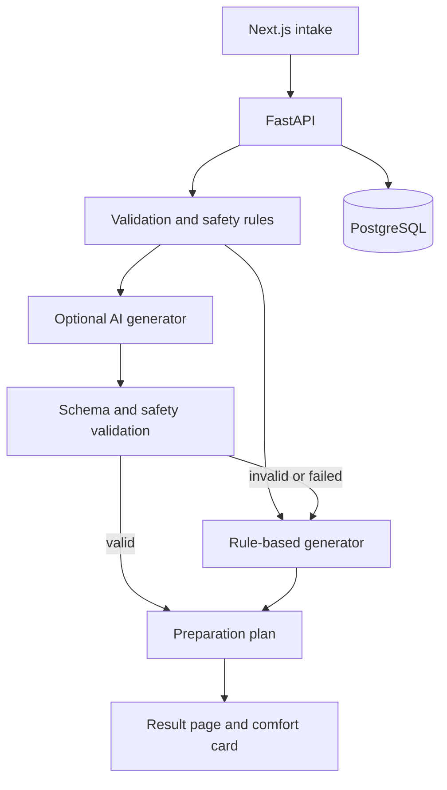

# SmileAtEase

**A full-stack visit-preparation tool that turns a structured dental-anxiety intake into a non-diagnostic preparation plan and printable comfort card.**

[Live frontend](https://smile-at-ease.vercel.app)

> **Status:** the intake, plan generation, safety rules, persistence, guide/policy pages, and local deployment stack are implemented. Authentication, analytics, PDF export, email sharing, and accounts are not.

## Why It Exists

Patients who feel anxious about dental care may struggle to explain triggers, communication preferences, and comfort needs during an appointment. SmileAtEase collects those preferences before the visit and produces a concise plan the patient can review or share.

The technical focus is controlled plan generation: deterministic safety handling is authoritative, optional AI output is schema-validated, and unsafe or malformed AI output falls back to the rule-based path.

## Key Features

- Multi-step intake with frontend and backend validation
- Non-diagnostic preparation plans and printable comfort cards
- Deterministic urgent/crisis handling that bypasses AI
- Rule-based generation as the default mode
- Optional AI generation behind a feature flag
- Schema, sanitizer, and safety validation before AI output is accepted
- Automatic fallback to rule-based generation on provider, schema, or safety failure
- PostgreSQL persistence with Alembic migrations and configurable retention
- Health and database-readiness endpoints
- Docker Compose environment for the complete local stack
- Backend test suite plus frontend route smoke, type, and production-build checks

## Architecture



Urgent and crisis inputs follow deterministic safety responses and never call the AI provider. AI mode is optional; the normal local and production default is rule-based generation.

## Technical Highlights

| Area | Implementation |
| --- | --- |
| API design | FastAPI routes with Pydantic request/response models |
| Safety | Deterministic escalation paths, sanitization, output validation, and fallback |
| Persistence | SQLAlchemy models, PostgreSQL, Alembic migrations, and retention settings |
| Frontend | Next.js App Router, TypeScript, React Hook Form, Zod, and Tailwind CSS |
| Deployment | Separate frontend/API containers plus PostgreSQL in Docker Compose |
| Verification | Backend unit/route tests and frontend route, type, and build checks |

## Tech Stack

- **Frontend:** Next.js 14, React 18, TypeScript, Tailwind CSS, React Hook Form, Zod
- **Backend:** Python 3.11+, FastAPI, Pydantic, SQLAlchemy, Alembic
- **Database:** PostgreSQL 16
- **Optional AI:** OpenAI provider behind `AI_PLAN_MODE=ai`
- **Tooling:** pytest, TypeScript, Docker Compose

## Getting Started

```bash
cp .env.example .env
docker compose up --build
```

Open:

- Frontend: `http://localhost:3000`
- API health: `http://localhost:8000/api/health`
- API readiness: `http://localhost:8000/api/readiness`

Expected health response:

```json
{"status":"ok"}
```

## API Example

Generate a plan with a validated intake:

```http
POST /api/plans/generate
Content-Type: application/json
```

The endpoint validates the intake, saves the assessment, runs the configured generation path, applies safety checks, persists the plan, and returns the result. Sample normal, boundary, urgent, crisis, cost, and judgment-related inputs are documented in [docs/sample-intakes.md](docs/sample-intakes.md).

Other implemented routes include:

- `POST /api/assessments` — validate and store an assessment
- `GET /api/health` — service health
- `GET /api/readiness` — database connectivity readiness

## Testing

Frontend:

```bash
cd apps/web
npm install
npm run smoke
npm run type-check
npm run build
```

Backend:

```bash
cd apps/api
python -m venv .venv
source .venv/bin/activate
pip install -e '.[dev]'
python -m pytest
alembic upgrade head --sql
```

Backend coverage includes assessment and plan routes, schemas, sanitization, deterministic generation, AI validation/fallback behavior, safety paths, configuration, and database models.

## Environment

All supported variables are documented in [.env.example](.env.example).

Important production values include:

- `DATABASE_URL`
- `BACKEND_CORS_ORIGINS`
- `PLAN_RETENTION_DAYS`
- `AI_PLAN_MODE`
- `AI_PROVIDER`
- `OPENAI_API_KEY`
- `OPENAI_MODEL`
- `AI_REQUEST_TIMEOUT_SECONDS`
- `NEXT_PUBLIC_API_BASE_URL`

Do not use wildcard CORS origins in production. AI mode also requires a provider key; rule-based mode does not.

## Project Status

### Implemented

- Landing, intake, result, guide, privacy, terms, and about pages
- Intake validation and sanitization
- Deterministic safety responses
- Rule-based and feature-flagged AI plan generation
- PostgreSQL assessment/plan persistence and migrations
- Configurable retention
- Docker Compose local environment
- Frontend and backend verification commands

### Not implemented

- Authentication or user accounts
- Analytics
- PDF export
- Email sharing
- Account history

## Deployment

The frontend can deploy independently to Vercel, while the API runs on a Python application host with managed PostgreSQL. Configure `NEXT_PUBLIC_API_BASE_URL`, production CORS origins, database credentials, retention, and optional AI settings before deployment.

See [DEPLOYMENT_CHECKLIST.md](DEPLOYMENT_CHECKLIST.md) for hosted setup, smoke testing, rollback, and AI-mode checks. See [DEMO.md](DEMO.md) for the local walkthrough.

## Important Boundary

SmileAtEase provides visit-preparation information, not diagnosis, treatment, or emergency care. The repository's deterministic safety responses and fallback behavior are designed around that boundary.
